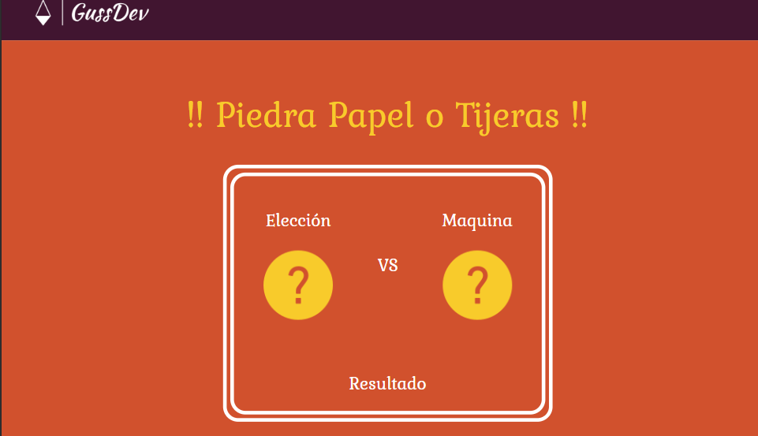

# ✊✋✌️ PlayJS - Piedra, Papel o Tijera

**PlayJS** es una divertida aplicación web del clásico juego "Piedra, Papel o Tijera", desarrollada con HTML, CSS y JavaScript puro. El jugador compite contra la máquina en una interfaz intuitiva, colorida y responsive.

## 🎮 Características

- Interfaz visual atractiva y adaptativa.
- Jugador vs máquina, con resultados instantáneos.
- Reinicio de partida con un solo clic.
- Imágenes temáticas para una mejor experiencia de juego.
- Código limpio y fácil de entender.

## 🧰 Tecnologías utilizadas

- 🧱 HTML5
- 🎨 CSS3 (con fuentes de Google Fonts)
- ⚙️ JavaScript vanilla

## 📂 Estructura del Proyecto

- `index.html`: Estructura principal del juego.
- `style.css`: Estilos del diseño del sitio.
- `main.js`: Lógica del juego (selección, comparación, resultado, reinicio).
- `src/img/`: Contiene los íconos e imágenes del juego.

## 🚀 Cómo usarlo

1. Clona el repositorio o descarga los archivos.
2. Abre el archivo `index.html` en tu navegador.
3. ¡Empieza a jugar haciendo clic en piedra, papel o tijera!

```bash
git clone https://github.com/tuusuario/playjs
cd playjs
```

## 📂 Imagen Previa


